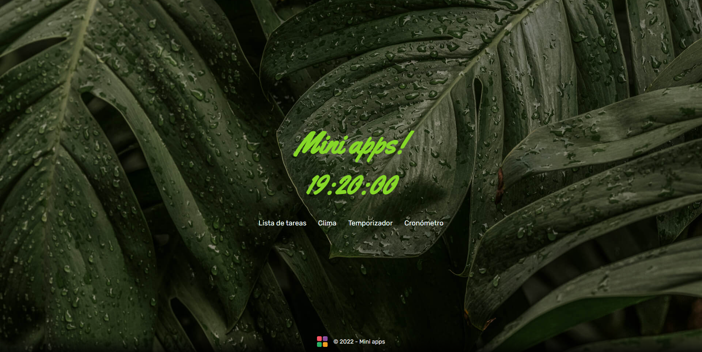

# JavaScript - Coderhouse

Presento aca mis desafios y proyecto final del [curso de JavaScript de Coderhouse](https://www.coderhouse.com/online/javascript).

## Proyecto final

Mini-Apps es una aplicación realizada bajo el concepto de Single Page Application (SPA), cuya finalidad es brindar herramientas simples que se usan a diario.

En ella se presentan 4 aplicaciones: 

- Lista de tareas
- App del clima
- Temporizador 
- Cronómetro

### Que aprendí con este proyecto
Para realizar esta app tuve que interiorizarme con los siguientes conceptos:
- Programación funcional basada en componentes
- API Fetch para la consulta de la API del [Servicio Meteorológico Nacional](https://ws.smn.gob.ar/map_items/weather)
- Eventos y delegación de eventos
- Manipulación del DOM
- Utilización de la libreria [Sweet alert 2](https://sweetalert2.github.io/) 

## Agradecimientos
Quiero finalizar agradeciendo al profe [Adrian Gonzalez](https://www.linkedin.com/in/adrgon/) quien siempre dio lo mejor en cada clase y al tutor Nahuel Cuenca quien me ayudo con los desafios y preentregas.

## Estemos en contacto!
- [LinkedIn](https://www.linkedin.com/in/nirodriguez/) 